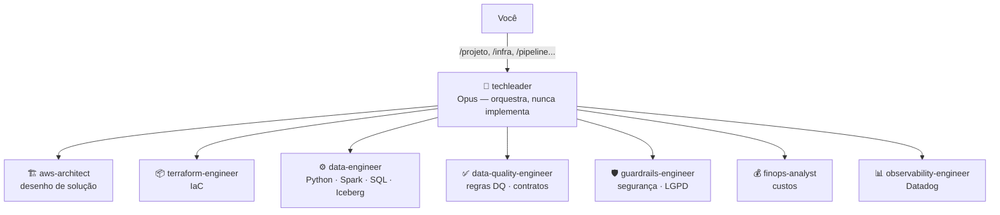

# Data Platform Team 🤖

Time de agentes especialistas para **Claude Code**, focado em desenvolvimento de infraestrutura e produtos de dados profissionais. Um agente orquestrador (**techleader**) coordena 7 especialistas, seguindo as melhores práticas de desenvolvimento de agentes da Anthropic: responsabilidade única, ferramentas mínimas por agente, contexto isolado, delegação com critérios de aceite e quality gates.

## Arquitetura do time



## Instalação

1. Copie as pastas `.claude/` e o arquivo `CLAUDE.md` para a **raiz do seu projeto** (ou use este diretório como base de um projeto novo).
2. Abra o projeto no VS Code e inicie o Claude Code no terminal integrado:
   ```bash
   claude
   ```
3. Verifique os agentes carregados com `/agents` e os comandos com `/help`.

> Agentes adicionados/editados direto no disco são carregados no início da sessão — reinicie o Claude Code após alterações nos arquivos.

## Comandos

| Comando | Exemplo |
|---|---|
| `/projeto` | `/projeto criar um produto de dados de vendas D-1: ingestão de 3 fontes, camadas bronze/silver/gold em Iceberg, SLA 7h` |
| `/infra` | `/infra bucket S3 de landing zone com lifecycle, KMS e replicação cross-region` |
| `/pipeline` | `/pipeline ingestão diária de pedidos do PostgreSQL para Iceberg via Glue, ~5M linhas/dia` |
| `/dq` | `/dq tabela silver.pedidos — chave pedido_id, freshness D-1 até 7h, valores financeiros devem reconciliar com a fonte` |
| `/custos` | `/custos estimar a arquitetura proposta no plano acima` ou `/custos otimizar os jobs Glue do diretório infra/` |
| `/observabilidade` | `/observabilidade pipeline ingestao_pedidos — crítico, SLA 7h, alertar time de dados no Slack` |
| `/revisar` | `/revisar` (diff atual) ou `/revisar infra/modules/lakehouse` |
| `/auditoria` | `/auditoria repositório completo desta plataforma` |

Você também pode invocar qualquer agente diretamente em linguagem natural:
> "Use o subagente data-engineer para otimizar o job em src/jobs/ingest.py"

## Estrutura

```
.
├── CLAUDE.md                      # Memória do projeto: padrões globais e quality gates
├── README.md
├── .gitignore
├── .claude/
│   ├── agents/                    # Definições dos 8 agentes (YAML frontmatter + system prompt)
│   │   ├── techleader.md
│   │   ├── aws-architect.md
│   │   ├── terraform-engineer.md
│   │   ├── data-engineer.md
│   │   ├── data-quality-engineer.md
│   │   ├── guardrails-engineer.md
│   │   ├── finops-analyst.md
│   │   └── observability-engineer.md
│   └── commands/                  # Slash commands
│       ├── projeto.md
│       ├── infra.md
│       ├── pipeline.md
│       ├── dq.md
│       ├── custos.md
│       ├── observabilidade.md
│       ├── revisar.md
│       └── auditoria.md
└── docs/
    └── ARQUITETURA.md             # Design do time e racional das decisões
```

## Princípios de design aplicados (best practices Anthropic)

- **Responsabilidade única**: cada agente faz uma coisa; o aws-architect desenha mas não escreve Terraform; o techleader orquestra mas não implementa.
- **Ferramentas mínimas**: agentes revisores (guardrails, finops, architect) são read-only + pesquisa; só quem implementa tem `Write`/`Edit`/`Bash`.
- **Modelos por função**: Opus no orquestrador (julgamento e coordenação), Sonnet nos especialistas (implementação).
- **Contexto isolado**: subagentes não compartilham memória — o techleader repassa contexto, critério de aceite e restrições em cada delegação.
- **Quality gates explícitos**: nenhuma entrega é "pronta" sem validação de testes, segurança, custo, DQ e observabilidade.
- **Human-in-the-loop**: `terraform apply` e planos de escopo grande sempre exigem aprovação humana.

## Customização

- Ajuste os padrões globais no `CLAUDE.md` (tags, naming, idioma).
- Edite o frontmatter `model:` de cada agente conforme seu plano/custo (`haiku`, `sonnet`, `opus`, `inherit`).
- Adicione MCP servers (ex.: Datadog MCP, AWS docs) e libere-os no campo `tools` dos agentes relevantes.
